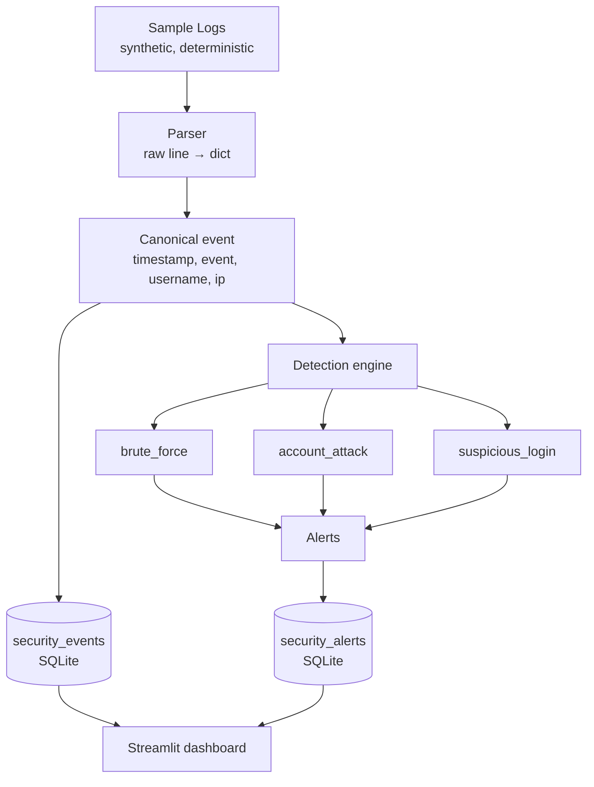

# security-log-analyzer

A defensive security log analyzer. It ingests log files, parses them
into structured events, runs configurable detection rules against those
events, and surfaces alerts. Not an offensive tool. Not a SIEM. Not a
log shipper. A focused detector with a small UI.

> **Status:** Days 1–2 of a 9-day build complete. Parser and detection
> engine are working and tested. Storage layer and Streamlit dashboard
> land on Days 3–4; Docker Compose, CI, and demo assets on Day 4.
> See [Project status](#project-status) for details.

---

## 1. Project overview

Log files tell you what happened. They do not tell you what's wrong.
A raw `auth.log` with ten thousand lines is a record, not a finding. The
gap between "the events are recorded" and "the events mean something" is
where security tooling lives, and it is the gap this project fills.

`security-log-analyzer` parses log files into a canonical event schema,
applies a small set of well-tested detection rules against them, and
stores both the events and the alerts those rules produce in SQLite.
A Streamlit dashboard then shows what a human needs to see: how many
events, which IPs are misbehaving, which accounts are being targeted,
and what the detector flagged.

The project is deliberately small. Three detection rules, one log
format, one storage backend. The reasoning is documented in
`docs/decisions.md` — each "why" has an answer that isn't "the AI
suggested it".

## 2. Problem being solved

Detecting a brute-force attack from a log file is not hard. Doing it
*reliably*, with tunable thresholds, boundary tests, and idempotent
storage, is the actual engineering problem. The interesting parts are
the edges:

- How many failures in how many minutes counts as a brute force?
  The answer has to be a config value, not a constant in code, because
  the right threshold depends on the environment.
- Is "successful login after a burst of failures" a compromise or a
  user who mistyped their password three times? The tool has to
  acknowledge that it cannot always tell, and say so.
- What happens when the same log file is processed twice? Duplicate
  alerts mean noise, and noise means the tool gets ignored.
- What if a rule has a bug and raises an exception? Does the whole
  detector go dark, or do the other rules keep running?

This project is a working answer to those questions, with tests that
prove the answers hold at the boundaries — not just on the happy path.

## 3. Architecture



**Note on "normalizer".** The original plan had a separate normalizer
stage. It doesn't exist as a separate module because the parser's output
**is** the canonical schema — a second pass to rename or reshape fields
would be ceremony, not engineering. If a second parser is added later
(e.g. JSON-lines), the contract guarantees both parsers produce the
same shape, and the detection engine doesn't need to know which one
read the file.

**Flow, step by step:**

1. `scripts/generate_sample_logs.py` writes deterministic synthetic logs
   into `sample_logs/`. No randomness — every run produces byte-identical
   files, so `sample_logs/expected_alerts.json` stays true.
2. `analyzer.parser.log_parser` turns each line into a dict.
   Malformed lines are skipped and counted, not fatal.
3. `analyzer.detection.engine` loads thresholds from
   `config/detection.yaml`, then fans out to each rule. Rules are pure
   functions: `(events, rule_config) -> list[Alert]`.
4. `Alert` objects are collected. If one rule raises, the others still
   run — logged at ERROR.
5. *(Day 3)* Events and alerts are written to SQLite. Loads are
   idempotent — running detection twice on the same log does not
   duplicate alerts.
6. *(Day 3)* The Streamlit dashboard reads both tables and shows
   counts, charts, and an alert list.

## 4. Technologies

| Layer | Choice | Why |
|---|---|---|
| Language | Python 3.11+ | Same as my data-engineering project; one mental model. |
| Parsing | `re` (stdlib) | One controlled format, anchored regex. No parser library needed. |
| Config | YAML (`pyyaml`) | Human-editable thresholds; comments allowed. |
| Detection | Pure functions | Testable in isolation; no framework, no DSL, no rules engine. |
| Storage | SQLite | Single-writer, small dataset, no DB container in the demo. Abstracted so Postgres is a connection-string change. |
| Dashboard | Streamlit | No frontend to build or maintain. |
| Packaging | `pyproject.toml` + pytest `pythonpath` | Tests import without an installable package. |
| Tests | `pytest` | Boundary cases as first-class tests. |
| Containerisation | Docker + Compose | *(Day 4)* One command, no host Python required. |
| CI | GitHub Actions | *(Day 4)* `pytest` on every push. |

## 5. Project structure

```
security-log-analyzer/
├── README.md
├── requirements.txt
├── pyproject.toml                 # pytest: pythonpath = ["src", "tests"]
├── .gitignore
├── .env.example
├── docker-compose.yml             # (Day 4)
├── Dockerfile                     # (Day 4)
├── config/
│   └── detection.yaml             # thresholds, not hardcoded
├── scripts/
│   └── generate_sample_logs.py    # deterministic synthetic logs
├── sample_logs/
│   ├── .gitkeep
│   └── expected_alerts.json       # hand-authored ground truth
├── src/
│   └── analyzer/
│       ├── __init__.py
│       ├── alerts.py              # Alert dataclass (frozen)
│       ├── parser/
│       │   ├── __init__.py
│       │   └── log_parser.py      # raw line → dict | None
│       ├── detection/
│       │   ├── __init__.py
│       │   ├── engine.py          # load config, fan out to rules
│       │   ├── brute_force.py
│       │   ├── account_attack.py
│       │   └── suspicious_login.py
│       ├── storage/               # (Day 3)
│       │   ├── __init__.py
│       │   ├── db.py
│       │   └── schema.sql
│       └── run.py                 # (Day 3) CLI entrypoint
├── dashboard/
│   └── app.py                     # (Day 3) Streamlit
├── tests/
│   ├── helpers.py                 # shared event constructors
│   ├── test_parser.py
│   ├── test_detection_brute_force.py
│   ├── test_detection_account_attack.py
│   ├── test_detection_suspicious_login.py
│   └── test_detection_engine.py
└── docs/
    ├── decisions.md               # every "why" answered
    └── architecture.md            # (Day 4) longer-form diagram + notes
```

## 6. How to run

### Working today (Days 1–2: parser + detector)

```bash
git clone <repo> && cd security-log-analyzer
python -m venv .venv
source .venv/bin/activate           # Windows: .venv\Scripts\activate
pip install -r requirements.txt

# 1. Generate the synthetic log files.
python scripts/generate_sample_logs.py

# 2. Run the detector end-to-end over them.
python - <<'PY'
from pathlib import Path
from analyzer.detection.engine import load_config, run_detection
from analyzer.parser.log_parser import parse_file

config = load_config("config/detection.yaml")
for log in sorted(Path("sample_logs").glob("*.log")):
    events = parse_file(log)
    alerts = run_detection(events, config)
    print(f"{log.name}: {len(events)} events -> {len(alerts)} alert(s)")
    for a in alerts:
        print(f"  {a.alert_type} ip={a.ip_address} "
              f"user={a.username} count={a.event_count}")
PY

# 3. Run the tests.
pytest -q
```

### Target (Day 4 onward, once Docker lands)

```bash
docker compose up
# → runs the pipeline on sample_logs/, writes to the named volume,
#   and serves the dashboard on http://localhost:8501
```

**Until then, the local path above is the supported one.** The Docker
setup is on the Day 4 task list, not a claim about the current state.

## 7. Example output

Detector output over the four committed scenarios (this runs today):

```
account_attack.log:   10 events -> 1 alert(s)
  ACCOUNT_ATTACK   ip=10.0.0.5        user=None    count=10
borderline.log:        4 events -> 0 alert(s)
brute_force.log:      14 events -> 1 alert(s)
  BRUTE_FORCE      ip=192.168.1.20    user=musa    count=14
normal.log:            6 events -> 0 alert(s)
suspicious_login.log:  4 events -> 1 alert(s)
  SUSPICIOUS_LOGIN ip=203.0.113.7     user=alice   count=4
```

The `suspicious_login.log` case is worth pointing at: three failures
spread across three usernames, then a success as `alice` — all from the
same IP. It does **not** trigger `BRUTE_FORCE` (no single user reaches
5 failures) and does **not** trigger `ACCOUNT_ATTACK` (only 3 distinct
usernames, threshold is 5). It triggers exactly one rule, which is the
one whose shape it matches. That's the detector behaving correctly, and
it's asserted in `sample_logs/expected_alerts.json`.

Once the storage layer lands (Day 3), an alert row in SQLite looks like:

```
id           = 1
alert_type   = BRUTE_FORCE
severity     = HIGH
ip_address   = 192.168.1.20
username     = musa
first_seen   = 2026-09-13 10:00:00
last_seen    = 2026-09-13 10:01:44
event_count  = 14
details      = {"threshold": 5, "window_minutes": 2}
```

## 8. Detection rules

All thresholds live in `config/detection.yaml`. Changing a threshold is
a config edit, not a code change and redeploy — a detector whose
sensitivity can't be tuned is security theatre.

### `brute_force`

Fires when **≥ N `LOGIN_FAILED` events for the same `(username, ip)`
pair occur inside a sliding window.**

| Config key | Default | Meaning |
|---|---|---|
| `max_failed_logins` | 5 | Minimum failures to fire. |
| `time_window_minutes` | 2 | Sliding window length. |
| `severity` | HIGH | Attached to every alert this rule emits. |

Design notes:

- Grouped by **`(username, ip)`**, not by username alone. 5 failures
  spread across two IPs is not a brute force from either IP.
- A burst collapses into **one alert** covering the whole burst, not one
  alert per event. 14 failures in 2 minutes is one incident.
- Two bursts an hour apart are **two alerts**. The rule skips past a
  fired burst rather than sliding through it.
- Window is half-open: `[start, start + window)`. The boundary is
  explicit and testable, not "depends how you read `within`".

### `account_attack`

Fires when **one IP accumulates ≥ N distinct usernames as
`LOGIN_FAILED` targets inside a sliding window.**

| Config key | Default | Meaning |
|---|---|---|
| `max_distinct_usernames` | 5 | Minimum distinct users targeted. |
| `time_window_minutes` | 5 | Sliding window length. |
| `severity` | HIGH | Attached to every alert this rule emits. |

Design notes:

- Different shape from brute force: brute force is **volume against one
  target**, this is **breadth against many**. Same input event type,
  different grouping key and counter — which is why they're separate
  rules and not one rule with a flag.
- Alerts have `username = None`. The IP is the subject; there is no
  single target. The list of targeted users is in `details`.

### `suspicious_login`

Fires when **a `LOGIN_SUCCESS` occurs from an IP that has produced ≥ N
`LOGIN_FAILED` events within the preceding lookback window.**

| Config key | Default | Meaning |
|---|---|---|
| `failure_burst_threshold` | 3 | Minimum prior failures. |
| `lookback_minutes` | 5 | How far back to look from the success. |
| `severity` | MEDIUM | Attached to every alert this rule emits. |

Design notes:

- Keyed on **IP, not `(username, ip)`**. The classic attack is a burst
  of failures followed by a success — and the burst may have targeted
  *other* users. If it keyed on `(user, ip)`, an attack that tried
  `alice`/`bob`/`carol` and then succeeded as `dave` would be invisible.
- This is the rule with the **documented false positive**: a user who
  mistypes their password three times and then gets it right produces
  exactly the pattern this rule looks for. Asserted in
  `test_typo_then_success_fires_documented_false_positive` so that
  reducing it later is a deliberate, visible change — not an accidental
  behaviour shift.

## 9. Testing

```bash
pytest -q
```

**50 test cases across 5 files.** The ratio is deliberate — most tests
probe a boundary or a rejection, not the happy path.

| File | Focus |
|---|---|
| `test_parser.py` | 1 happy path, 12 rejection paths (missing fields, impossible dates, unknown events, ISO-format drift, trailing garbage), whitespace tolerance, raw-line preservation, file-level skip-and-count. |
| `test_detection_brute_force.py` | Below threshold, at threshold, configurable threshold, failures spread beyond window, burst collapse, two separated bursts, split across IPs, split across users, successes ignored. |
| `test_detection_account_attack.py` | Below/at threshold, repeated same-user attempts not counting as distinct, window boundary, per-IP independence, successes ignored. |
| `test_detection_suspicious_login.py` | At/below threshold, lookback boundary, keyed-on-IP behaviour, the documented false positive, multiple successes. |
| `test_detection_engine.py` | Empty input, rules run independently on shared input, missing config block skipped, a raising rule not blinding the others. |

**What's covered conceptually:**

- Every threshold is probed from both sides (`N-1` fails, `N` fires).
- Every rule has at least one test proving it does **not** fire on a
  borderline case.
- Every grouping key has a test that would fail if the key changed.
- Rule contracts (`pure`, `(events, config) -> list[Alert]`) are
  enforced by the tests themselves — no mocks needed.
- The engine is tested for resilience, not just correctness.

**What's not covered yet (Days 3–4):**

- Storage idempotency (running the loader twice must not duplicate).
- End-to-end pipeline test from log file to dashboard query.
- Property-based fuzzing of the parser (planned Day 5).

## 10. Security considerations

A defensive security tool has to be honest about its own posture. This
one takes the following positions by design:

- **Read-only with respect to observed systems.** The tool never
  authenticates to, writes to, or controls the systems whose logs it
  reads. It observes output; it does not act on input.
- **The database inherits the sensitivity of its input.** Log lines
  contain usernames and IP addresses — potentially PII, potentially
  sensitive. The SQLite file is not encrypted. In a real deployment it
  would be, or it would sit behind the same access controls as the
  source logs. This is a local demo and is documented as such.
- **No authentication on the dashboard.** Streamlit binds to localhost
  by default. This is a demo, not a deployment. Adding auth would be
  scope creep that pretends the local demo is a production service.
- **Parameterized SQL only.** All storage access goes through
  parameterized queries. *(The storage layer itself lands Day 3; this
  is a commitment for that implementation, recorded here so it's not
  quietly dropped.)*
- **No offensive capability, no "attack mode".** The tool has no port
  scanning, no exploit code, no active probing. It is a reader.
- **No external calls.** No threat-intel feeds, no GeoIP lookups, no
  telemetry. The tool is fully offline and deterministic.

## 11. Limitations

Being honest about what this project does *not* do is more credible
than pretending its scope is larger than it is.

- **One log format.** The parser reads the synthetic format produced by
  `scripts/generate_sample_logs.py`, not syslog, not nginx, not Windows
  Event Log. The architecture supports adding parsers with the same
  `raw line -> dict | None` contract; the project only ships one.
- **Threshold-based, not behavioural.** Detection is "N events in M
  minutes", not "unusual pattern". No baselining, no anomaly detection,
  no ML — deliberately.
- **Slow-and-low attacks evade the rules.** Five failures spread over
  three hours never fires `brute_force`. This is a real false negative
  and the tradeoff is documented: shorter window means fewer false
  positives and more false negatives. Fixing it properly is a
  *different rule*, not a tuning change.
- **Distributed brute force is not covered.** One user, many IPs, one
  failure each. Neither `brute_force` nor `account_attack` catches this.
- **Typo-then-success is a documented false positive.** See §8 above
  and `docs/decisions.md` §5.
- **No alert delivery.** The tool surfaces alerts in the dashboard and
  in the database. It does not email, page, or webhook. Alerts are
  pull-only.
- **Single-writer SQLite.** Fine for one analyzer process reading log
  files. Not fine for concurrent writers or horizontal scale. The
  storage layer is abstracted; swapping to Postgres is a connection
  string and a driver, not a rewrite.
- **No GeoIP, no user-agent correlation, no session reconstruction.**
  All would require state or data this project doesn't carry.

## 12. Future improvements

Ordered by value, not by ambition:

1. **Slow-and-low rule.** Aggregate failures per IP per day, separate
   from the short-window rules. Directly addresses the first limitation
   above.
2. **Distributed brute-force rule.** Aggregate failures *per user
   across IPs*, not per `(user, ip)`. Same shape as `brute_force`, but
   keyed differently.
3. **Streaming ingestion.** Tail a growing log file instead of reading
   it whole. Matters for real logs; not for this demo.
4. **Second parser (JSON-lines).** Demonstrates the parser contract
   actually generalises. Cheap to add, high signal.
5. **Alert deduplication by burst ID.** Currently each success in the
   lookback window of a burst gets its own `suspicious_login` alert.
   A `burst_id` on the alert would let the dashboard group them. This
   is a design change, not a bug fix — see the test that documents the
   current behaviour.
6. **Pluggable storage backend.** Postgres/SQLite behind one interface.
   Would need a real reason (concurrency, retention); not yet.
7. **Property-based fuzzing of the parser** with `hypothesis`. Planned
   for Day 5 of the current build.

---

## Project status

- [x] **Day 1** — scaffold, synthetic log generator, parser, parser tests.
- [x] **Day 2** — detection engine, three rules, boundary tests, ground truth for all rules.
- [ ] **Day 3** — SQLite storage (idempotent loads), Streamlit dashboard.
- [ ] **Day 4** — Docker + Compose, GitHub Actions CI, full README pass, demo assets.
- [ ] **Days 5–9** — hardening, additional rule, second parser, performance, dashboard depth, buffer.

## Design decisions

Every non-trivial choice has a written rationale in
[`docs/decisions.md`](docs/decisions.md). If you're a reviewer and have
a "why this design?" question, that file is the answer.