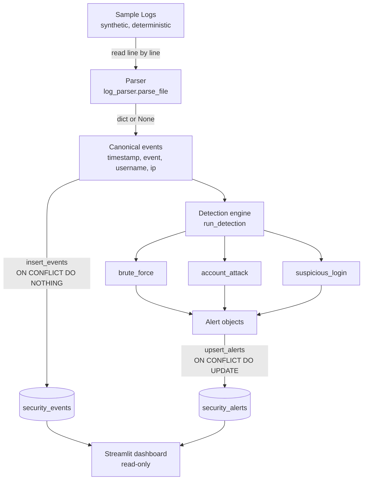

# Architecture

A longer-form companion to the diagram in the README. Explains what each
layer is responsible for, what it deliberately does *not* do, and where
the seams are for future work.

## Diagram

## Layer responsibilities

### Parser

**Does:** reads a log line, returns a canonical event dict or `None`.

**Does not:** log, raise, retry, filter by event type, or decide what
"malformed" means at the pipeline level. The parser's `parse_file`
skips malformed lines and counts them — the count is a warning, not an
exception, because losing 99,999 good lines to one bad one is worse
than losing the bad one.

**Contract:** `parse_line(line: str, source_file: str) -> dict | None`.
Any future parser (JSON-lines, syslog, nginx) must satisfy the same
contract to slot into the pipeline. That's the seam.

### Detection engine

**Does:** loads config, fans out to every registered rule, collects alerts.
Catches rule exceptions so one broken rule cannot blind the others.

**Does not:** know what any rule does internally. Adding a rule is
editing `RULES` in `engine.py` and adding a config block. That's it.

**Contract:** every rule module exposes
`detect(events: list[dict], config: dict) -> list[Alert]`. Rules are
pure — same input, same output, no I/O, no globals. That's what makes
boundary tests one-liners and what makes the engine trivially parallelisable
if it ever needs to be.

### Storage

**Does:** opens SQLite with WAL, creates the schema, inserts events
idempotently, upserts alerts idempotently, exposes counts.

**Does not:** transform data. It stores exactly what the parser and
detector produce. Any reshaping belongs upstream, in the layer that owns
the semantic decision.

**Contract:** the rest of the app talks to `analyzer.storage.db`, never
to `sqlite3` directly. Swapping to Postgres means rewriting `db.py`;
nothing else changes.

### Dashboard

**Does:** reads both tables, shows counts, charts, and an alert list.

**Does not:** write, cache aggressively, authenticate, or filter.
Read-only by construction — only `read_sql_query` is called.

**Contract:** the dashboard's job is to answer "what did the detector
find?" in under ten seconds of scanning. Anything that doesn't serve
that job is deferred.

## Seams for future work

Three extension points, in the order I'd actually add them:

1. **Second parser.** Add `src/analyzer/parser/json_lines.py` with the
   same contract. Add a registry that picks by file extension. Zero
   changes to detection, storage, or dashboard.
2. **Streaming ingestion.** `parse_file` already yields events into a
   list; making it a generator and having the pipeline batch inserts
   would let it handle logs larger than memory. Confined to `run.py` and
   `db.py`.
3. **Storage backend.** Define a `Storage` protocol in
   `storage/__init__.py`, implement `SQLiteStorage` and `PostgresStorage`
   behind it, swap via config. Confined to `storage/`.

What would *not* be a clean extension, and why:

- **Rule chains / rule dependencies.** Rules today are independent.
  Making one rule's output feed another requires a DAG and a scheduler,
  which is a different architecture, not a bigger one.
- **Alert delivery (email, webhook).** This belongs downstream of the
  pipeline as a separate consumer reading `security_alerts`. Wiring it
  into `run_detection` would couple detection to delivery.
- **ML anomaly detection.** Different detection paradigm, different
  data requirements, different evaluation. Not an extension of these
  rules — a parallel system.